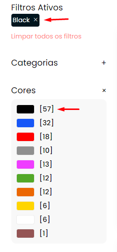
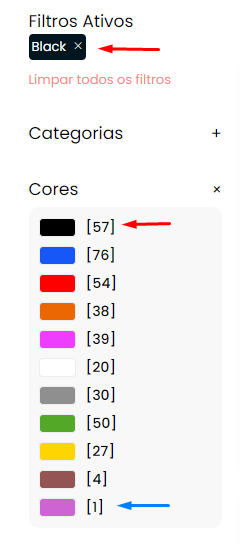
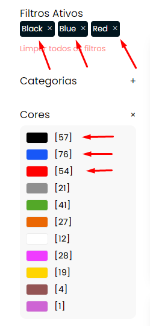

# Categoria e Pesquisa

A página de categoria ou conhecida também como listagem de produtos, possui alguns componentes para facilitar a vida do cliente em sua navegação. Vamos falar primeiro sobre o componente principal, a listagem dos produtos.

## Listagem de produtos 
Segue abaixo o código HTML base de exemplo:

```html
<main>
    ...

    <pwa-result-list size="24" automatic-scrolls="3">
        <div pwa-each-product>
            <pwa-product-card>
        </div>

        <pwa-hidden>
            <div pwa-is-loading>
                carregando...
            </div>
        </pwa-hidden>

        <div pwa-not-last-page>
            <a pwa-not-loading pwa-load-more>Carregar mais</a>
        </div>    
    </pwa-result-list>
</main>
```

A tag `pwa-result-list` é o componente responsável por trazer todos os produtos encontrados da categoria buscada. Temos então dois atributos que acompanham a tag, são eles:

- `size`: Quantidade de produtos listados por paginação.
- `automatic-scrolls`: Quantidade de rolagem automática para a próxima página, sem a necessidade de clicar no botão "carregar mais".

Além dos atributos que acompanham o componente de busca, temos os controles:
 
| Controle                  | Descrição                                                                 
|---------------------------|-------------------------------------------------------------------------|
| `pwa-each-product`        | Lista todos os produtos encontrados                                     |
| `pwa-is-loading`          | Mostra a mensagem "carregando.." enquanto são buscados.                 |
| `pwa-not-last-page`       | Verifica se a página atual não é a última listada                       |
| `pwa-not-loading`         | exibe os elementos dentro dela após os produtos serem encontrados       |
| `pwa-load-more`           | Funcionalidade de buscar mais produtos para a lista                     |

Agora sim temos o básico da listagem de produtos.

## Filtros

Os filtros são componentes separados da listagem de produtos, ou seja, <strong> NÃO aplique nenhum componente filtro dentro da tag `pwa-result-list` </strong>. Assim evitamos erros de compilação, e até mesmo o mal funcionamento dos filtros.

### Filtros de ordenação

Segue o código de exemplo abaixo:

```html
<pwa-manual-filter>
    <label for="filter">Ordenar por</label>
    <select pwa-filter-input name="filter">
        <option value="product_id:-">Lançamentos</option>
        <option value="price:+">Mais baratos</option>
        <option value="price:-">Mais caros</option>
    </select>
</pwa-manual-filter>
```

O Filtro de ordenar traz por padrão alguns campos já configurados, como `price`, e `product_id` para lançamentos. Mas você pode utilizar outros atributos do seu produto para ordenar, basta inserir o valor `+` para "Crescente" e `-` Decrescente. Lembrando se for um campo cujo seu valor é um "texto", a ordenação será em ordem "Alfabética", e campos com valores numéricos, sua ordenação será em "ordem crescente/decrescente numérica".


### Filtrar por categoria

```html
<pwa-category-list pwa-parent="category.id" size="10">
    <h2>Categorias</h2>

    <div>
        <div pwa-each-category>
            <a pwa-to-category-page>
                {{ category.name }}
            </a>
        </div>
    </div>
</pwa-category-list>
```

Nossa conhecida tag `pwa-category-list` pode estar em todos os lugares do projeto, por isso, utilizá-la como filtro de categorias e subcategorias é uma boa opção. Vamos aos atributos da tag:

- `pwa-parent`: Através do objeto "category" podemos acessar o seu id, e com isso, passarmos o valor da categoria pai, onde nesse caso é a própria categoria listada na tela. Apenas com o id, o componente faz todo o trabalho de buscar todas as suas subcategorias e listando abaixo através dos controles:

| Controle                  | Descrição                                                                 
|---------------------------|------------------------------------------------------------------------|
| `pwa-each-category`       | Traz todas as categorias/subcategorias encontradas                     |
| `pwa-to-category-page`    | Redireciona o cliente para a página de subcategoria selecionada        |


### Filtros de Variações do Produto

```html
<pwa-variation-filter code="color" multiple>
    <div pwa-has-filters>
        <h2>Cores</h2>
    </div>

    <div pwa-has-filters>
        <div>
            <a pwa-each-filter pwa-filter-input="data-checked">
                {{ (filter || {}).name }} -
                [{{ filter.count }}]
            </a>
        </div>
    </div>
</pwa-variation-filter>
```

A tag pai `pwa-variation-filter` é o componente responsável por tratar e trazer todos resultados encontrados, nesse caso as "cores" dos produtos listados. Para o seu total funcionamento, temos alguns atributos e parâmetros a serem passados, são eles:

- `code`: campo que será buscado para exibir na lista de filtros.
- `multiple`: Como um checkbox, o multiple te dá a oportunidade de escolher não somente uma, mas quantas cores você quiser filtrar.

<strong>Lembrando que:</strong> o atributo `code` é representado por atributos da `variação` do produto, ou seja, campos que pertencem à variação e configuração do produto como cores, tamanhos e etc.

Agora vamos aos controles do código HTML acima:

| Controle                  | Descrição                                                                 
|---------------------------|------------------------------------------------------------------------|
| `pwa-has-filters`         | Verifica se foi encontrado algum filtro do valor do atributo `code`    |
| `pwa-each-filter`         | Traz todos os filtros encontrados                                      |

Para a listagem dos valores dos filtros encontrados, temos o objeto `filter`, onde você pode encontrar o valor do filtro como por exemplo `filter.name` ou `(filter || {}).name` (verifica se o objeto filter é válido antes de chamar seu atributo name (é apenas uma forma simplificada de validação de atributos do JS). Temos também o `filter.count`, que exibe quantidade de resultados encontrados para aquele determinado filtro. Nesse caso das cores, podem ser listados: 

```html
    <a>Amarelo - [50]</a>
    <a>Verde - [10]</a>
    <a>Azul - [30]</a>
```

Pode ser que o seu projeto ao invés de conter o nome cor, tenha o swatch da cor, como exemplo `filter.name` vai listar `#000`, para utilizar o swatch em alguma tag do html como background, você pode seguir o exemplo do código abaixo:

```html
    <span pwa-style="{ backgroundColor: (filter || {}).name }"></span>
```


### Filtro de Preço

Temos dois tipos de filtros de range de preço, o primeiro é o estilo "drag", onde você arrasta os pontos e define o range para filtrar.

```html
<pwa-price-filter>
    <h2> Filtrar por preço </h2>

    <fieldset>
        <div>
            <range-slider  v-model="component.current" :enable-cross="false" :min="component.min" :max="component.max" tooltip="always" />
        </div>

        <button pwa-range-submit>
            Filtrar
        </button>
    </fieldset>
</pwa-price-filter>
```
Temos dois componentes nesse modelo de filtro, sendo o componente pai `pwa-price-filter` e dentro dele `range-slider`.
O componente `range-slider` é a principal peça para criar o input com os bullets de range. Vamos aos atributos e parâmetros desse elemento.

- `v-model`: Representa o valor do range selecionado em forma de array: [min, max]
- `:enable-cross`: proibe os dois bullets de range se cruzarem entre si para não gerar valores onde o preço mínimo passe a ser maior do que o máximo.
- `:min`: Representa o valor mínimo do range
- `:max`: Representa o valor máximo do range

| Controle                  | Descrição                                                                 
|---------------------------|-----------------------------------------------------------------|
| `pwa-range-submit`        | Faz a submissão do filtro de acordo com o range selecionado.    |

O Segundo modelo é baseado em dois inputs, um para o valor mínimo e o outro para o valor máximo:

```html
<pwa-price-filter max-size="5">
    <div>
        <h2>Preço</h2>

        <div>
            <label for="price-from">De R$</label>
            <input pwa-range-min-input type="number" name="price-from">

            <label for="price-to">até R$</label>
            <input pwa-range-max-input type="number" name="price-to">

            <button pwa-range-submit type="button">Filtrar</button>
        </div>
    </div>
</pwa-price-filter>
```

| Controle                  | Descrição                                                                 
|---------------------------|-----------------------------|
| `pwa-range-min-input`     | Valor mínimo do range       |
| `pwa-range-max-input`     | Valor máximo do range       |
| `pwa-range-submit`        | Submissão do filtro         |


### Filtros Personalizados

Filtros personalizados são utilizados geralmente para campos customizados pertencentes ao produto. Segue um exemplo abaixo:

```html
<pwa-attribute-filter multiple attribute="brand">
    <div pwa-has-filters >
        <h2>Marcas</h2>
    </div>

    <div pwa-has-filters>
        <a pwa-each-filter pwa-filter-input="data-checked">
            {{ filter.label }} [{{ filter.count }}]
        </a>
    </div>
</pwa-attribute-filter>
```

Na tag pai `pwa-attribute-filter` temos os seguintes atributos.
- `attribute`: Recebe o campo a ser buscado para a criação do filtro, geralmente são campos customizados do produto, como "Marcas, Tipo de Fabricação, Datas entre outros.."
- `multiple`: Como um checkbox, o multiple te dá a oportunidade de escolher não somente um, mas vários valores do mesmo filtro que você quiser. (*OPCIONAL)
- `pwa-has-filters`: Verifica se foi encontrado algum filtro do valor do atributo `attribute`.
- `pwa-each-filter`: Traz todos os filtros encontrados.


### Filtros selecionados

```html
<pwa-tags-filter>
    <div pwa-has-filters>
        <div pwa-each-filter>
            {{ filter.value  }} 
            <a pwa-remove-filter="click">remover</a>
        </div>
    </div>
</pwa-tags-filter>
```

Essa função é bastante útil para a listagem dos filtros selecionados pelo usuário, assim ele conseguirá identificar na tela, quais foram os filtros utilizados na sua busca e caso queira, poderá removê-los e montar uma nova combinação de filtros para a listagem dos produtos.

- controle `pwa-remove-filter`: Remove o filtro selecionado.

## Filtros Múltiplos e Estáticos

Além da possibilidade de criar filtros através de diferentes atributos dos produtos de sua loja, existe também a possibilidade de trocar o estado comportamental do filtro através dos atributos `static` e `multiple`, explicando de uma forma mais simples, você pode definir por exemplo, que o seu filtro de cores será sempre o mesmo de acordo com a busca/categoria que você estiver na tela. Vamos aos exemplos:

### Estático (static)

Ainda utilizando o exemplo do filtro de cores, vamos definir para que o filtro seja estático, ou seja, se eu acessar a página de categoria "/meias" por exemplo, eu vou trazer todas as cores relacionadas à "meias" da loja.

```html
<pwa-variation-filter code="color" static>
    ...
</pwa-variation-filter>
```

Note que na tag principal `pwa-variation-filter` está sendo chamado o atributo `static`. Veja o antes e o depois de aplicar o `static`.

<div style="display: flex; flex-flow: row;"> 
    <figure style="display: flex; flex-flow: column; width: 45%">
        <h3>Sem "static"</h3>
        
    </figure>
    <figure style="display: flex; flex-flow: column; width: 45%">
        <h3>Com "static"</h3>
        
    </figure> 
</div>

- Sem `static`: Note que ao selecionar o filtro da cor "preta", automáticamente os produtos buscados são todos aqueles que possuem uma variação "preta" porém, além da variação "preta", esses mesmos produtos possuem outras cores, que no caso são as cores listadas logo abaixo do preto. No entanto, não será listado produtos que não possuem cores pretas, contudo, as outra cores relacionadas à esse produto que não possui preto, também não serão listadas.

- Com `static`: Sabemos então que ao entrar em uma categoria/busca, os produtos encontrados trarão consigo todas as cores disponíveis. Ao selecionar a cor "preta", as outras cores permanecerão no filtro, ou seja, não é buscado dinâmicamente baseado na cor "preta". A seta "azul" no print, mostra que a cor "rosa" permenace no filtro, mesmo selecionando a cor "preta".


### Multiplos (multiple)

Através do multiple, é permitido que no mesmo filtro seja possível escolher mais de uma opção. Simples assim. Ex.:

```html
<pwa-variation-filter code="color" multiple>
    ...
</pwa-variation-filter>
```

- Na tag principal `pwa-variation-filter` é aplicado a tag `multiple`.




### Combinações de Comportamentos (multiple static)

Caso você queira combinar `multiple` e `static` no mesmo filtro, basta aplicar os dois na mesma tag principal. Como mostra o exemplo abaixo:

```html
<pwa-variation-filter code="color" multiple static>
    ...
</pwa-variation-filter>
```