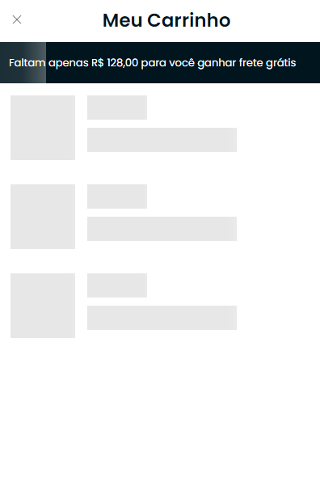

# Criando um novo Skeleton

Skeleton pode ser uma ótima escolha para carregar os componentes da sua página, vejamos o conceito básico abaixo de como utilizá-lo.

Teremos então duas tags que controlam e exibem o skeleton, são elas: `pwa-skeleton`, representando o corpo do skeleton, nele não possui o efeito de loading, pois serve apenas para agrupar os blocos e formar um elememento único, então o `pwa-skeleton-block` entra em ação, ele é o responsável por exibir os efeito dos blocos na tela. Vejamos o código de exemplo abaixo:

```html
    <pwa-skeleton w="33%" h="500px" size="3">
        <pwa-skeleton-block h="350px"/>
        <pwa-skeleton-block w="40%" h="30px"/>
        <pwa-skeleton-block h="30px"/>
    </pwa-skeleton>
```

- `pwa-skeleton`: Corpo do skeleton, é possível definir sua largura altura e quantidade de corpos que serão exibidos na tela. Parâmentros `w` largura, `h` altura e `size` quantidade. <strong>Todos os atributos desse componente são obrigatórios.</strong>

- `pwa-skeleton-block`: Membros do corpo que trazem o efeito de loading. Parâmetros `w` largura <strong>(CASO VOCÊ NÃO APLIQUE ESSE ATRIBUTO, A PWA POR PADRÃO APLICA A LARGURA DO BLOCK EM 100%)</strong>, `h` altura <strong>(atributo obrigatório)</strong>, no "block" não se utiliza a quantidade, pois se trata de um "quebra cabeça" que você precisa montar de acordo com o layout estipulado para o seu projeto.

No exemplo de HTML acima, temos o seguinte resultado, mostrado no print abaixo:


Como a tag `pwa-skeleton` representa apenas o corpo e não possui uma estrutura onde ele possa se "espalhar" pela tela com uma grid alinhada, é importante que você utilize uma div auxiliar em volta da TAG, e também, é importante lembrar o uso do controle `pwa-is-loading`, pois o skeleton é um elemento de carregamento, como mostra o exemplo real abaixo utilizada em um projeto PWA.

```html
<pwa-result-list size="24" automatic-scrolls="0" class="pwat-results__products">
    <span pwa-not-result style="padding: 100px 0px; text-align: center; width: 100%">Sem resultados para mostrar</span>

    <div class="pwat-results__list">
        <div pwa-each-product class="pwat-results__item">
            <pwa-product-card>
        </div>
    </div>

    <!-- SKELETON: Loading em execução até que se encontre os produtos -->
    <div pwa-is-loading class="pwat-results__list">
        <pwa-skeleton w="33%" h="500px" size="24">
            <pwa-skeleton-block h="350px"/>
            <pwa-skeleton-block w="40%" h="30px"/>
            <pwa-skeleton-block h="30px"/>
        </pwa-skeleton>
    </div>
    <!-- FIM SKELETON: -->

    <div pwa-not-last-page class="pwat-results__loading-more">
        <a pwa-not-loading pwa-load-more><i class="lnr lnr-chevron-down"></i>
            Carregar mais
        </a>
    </div>
</pwa-result-list>
```

- Note que no exemplo acima, foi reaproveitado a mesma classe <strong>pwat-results__list</strong> que cria a grid dos cartões de produto na tela de Categoria/Pesquisa.

## Manipulando o Skeleton

Além de cards de produto, pode ser feito diversos modelos de skeletons, de diferentes tamanhos, sendo acompanhado não somente pelo controle `pwa-is-loading`, mas também por variáveis locais criadas em hooks na qual pode ser chamadas através de um `pwa--if="variavelLoading"` (apenas uma dica). Bom, para manipular a estrutura do skeleton para que seja aplicado no carrinho por exemplo, siga o código abaixo:

```html
<div pwa-is-loading class="pwat-cart__list">
    <pwa-skeleton w="100%" h="80px" size="3">
        <pwa-skeleton-block h="80px" w="80px"/>
        
        <div class="pwat-cart__skeleton-col">
            <pwa-skeleton-block w="40%" h="30px"/>
            <pwa-skeleton-block h="30px"/>
        </div>
    </pwa-skeleton>
</div>
```

Note que nesse exemplo, também foi utilizado uma classe auxiliar para a grid, além do controle padrão do carrinho de loading `pwa-is-loading`. A questão principal do exemplo acima, é ver que a estrutura dos `pwa-skeleton-block` foi acompanhada por tags HTMLs que auxiliam na formação da grid interna do corpo `pwa-skeleton`, sendo assim, com a ajuda do css abaixo foi montado o skeleton dos itens do carrinho, o exemplo é feito apenas para os produtos listados no carrinho, mas você pode criar para todos os elementos do carrinho, textos, botões e etc..

```css
/*
    Skeleton Cart Items
*/
.pwat-cart__skeleton-col {
    width: 50%;
    display: flex;
    flex-flow: column;
    margin-left: 15px;
}
.pwat-cart__list .p4a-skeleton {
    margin-left: 15px;
    margin-top: 15px;
    margin-bottom: 15px;
}
```

<strong>Resultado:</strong>

